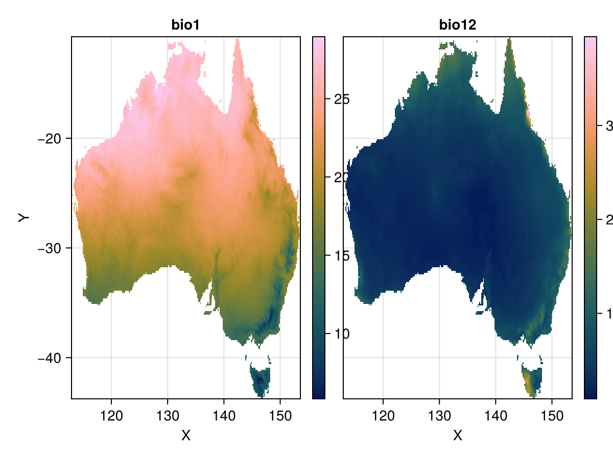
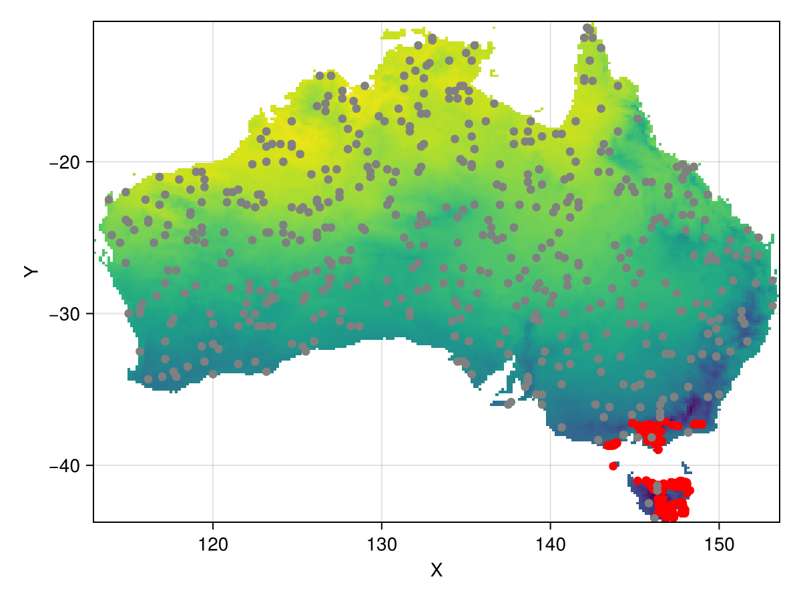
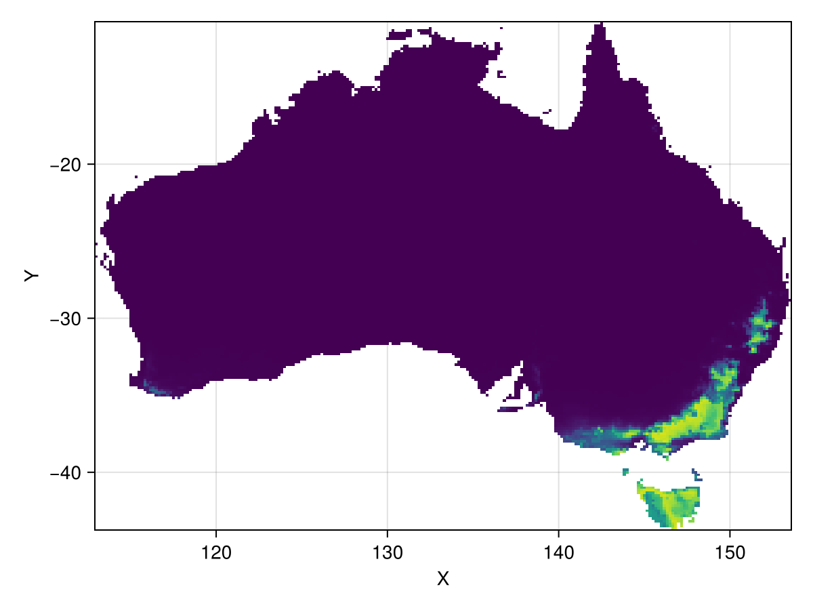
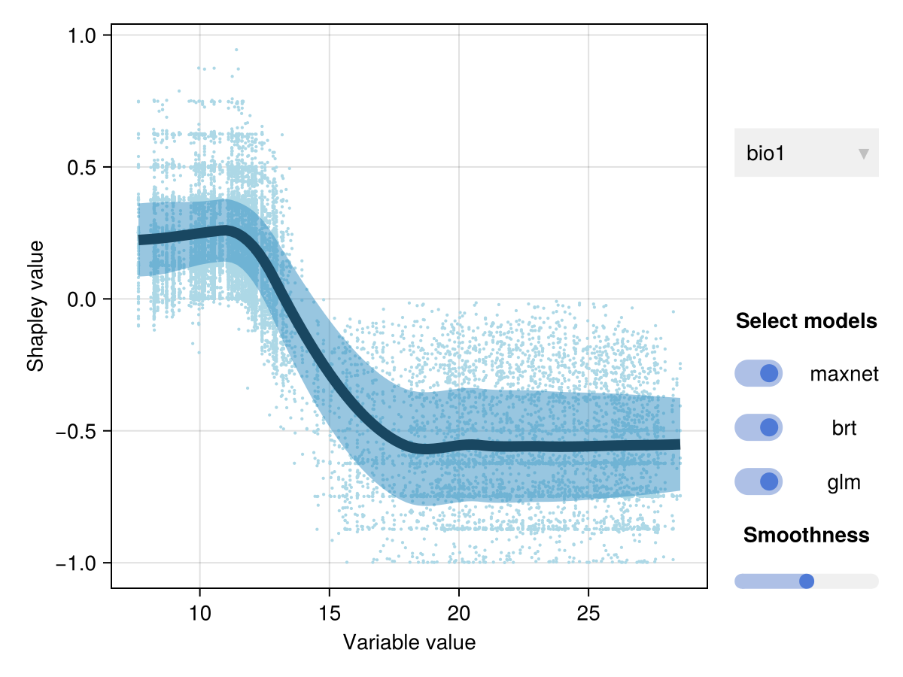

# Example of a full species distribution modelling workflow {#Example-of-a-full-species-distribution-modelling-workflow}

This example fits and projects species distribution models for the tree species _Eucaplytus regnans_ from scratch.

## Environmental data {#Environmental-data}

We start by downloading environmental data. We use the [Rasters](www.github.com/rafaqz/Rasters.jl) package to handle raster data, and RasterDataSources.jl to automatically download Worldclim data.

In this example, we just download bioclimatic variables 1 and 12 (annual mean temperature and annual mean precipitation). We then mask to the country borders of Australia.

```julia
using Rasters, RasterDataSources, ArchGDAL, NaturalEarth, DataFrames
bio = RasterStack(WorldClim{BioClim}, (1,12))
countries = naturalearth("ne_10m_admin_0_countries") |> DataFrame
australia = subset(countries, :NAME => ByRow(==("Australia"))).geometry
bio_aus = Rasters.trim(mask(bio; with = australia)[X = 110 .. 156, Y = -45 .. -10])
```


```ansi
┌ 244×198 RasterStack ┐
├─────────────────────┴────────────────────────────────────────────────── dims ┐
  ↓ X Projected{Float64} 112.99999999999999:0.16666666666666666:153.49999999999997 ForwardOrdered Regular Intervals{Start},
  → Y Projected{Float64} -10.833333333333334:-0.16666666666666666:-43.666666666666664 ReverseOrdered Regular Intervals{Start}
├────────────────────────────────────────────────────────────────────── layers ┤
  :bio1  eltype: Union{Missing, Float32} dims: X, Y size: 244×198
  :bio12 eltype: Union{Missing, Float32} dims: X, Y size: 244×198
├────────────────────────────────────────────────────────────────────── raster ┤
  missingval: missing
  extent: Extent(X = (112.99999999999999, 153.66666666666663), Y = (-43.666666666666664, -10.666666666666668))
  crs: GEOGCS["WGS 84",DATUM["WGS_1984",SPHEROID["WGS 84",6378137,298.25722...
└──────────────────────────────────────────────────────────────────────────────┘
```


Let&#39;s plot this data to see what it looks like.

```julia
using CairoMakie
Rasters.rplot(bio_aus)
```

{width=600px height=450px}

## Occurrence data {#Occurrence-data}

Next, we use [GBIF2.jl](www.github.com/rafaqz/GBIF2.jl) to download occurrence records for this species. We use the [thin](/api#SpeciesDistributionModels.thin-Tuple{Any,%20Any}) function in this package to weed out occurrences that are very close to each other, using a cut-off of 5km.

```julia
using GBIF2, SpeciesDistributionModels
sp = species_match("Eucalyptus regnans")
occurrences_raw = occurrence_search(sp; year = (1970,2000), country = "AU", hasCoordinate = true, limit = 2000)
occurrences = thin(occurrences_raw.geometry, 5000)
```


```ansi
1191-element Vector{Tuple{Float64, Float64}}:
 (145.98298, -38.33349)
 (147.255219, -41.237844)
 (147.497946, -41.301006)
 (145.19167, -37.41639)
 (146.35, -37.36667)
 (147.899871, -41.147461)
 (146.782197, -41.376415)
 (146.19722, -38.56889)
 (146.30667, -38.56472)
 (146.30333, -38.57611)
 ⋮
 (146.634191, -42.309965)
 (147.970709, -41.134905)
 (147.985049, -41.145683)
 (145.791172, -41.193094)
 (145.30611, -37.52194)
 (146.16306, -37.82861)
 (146.16306, -37.83)
 (146.16139, -37.82861)
 (146.15806, -37.83)
```


## Background points {#Background-points}

Next, we sample random points to use as background points.

Let&#39;s plot both the occurrence and background points to see where _Eucalyptus regnans_ is found.

```julia
using StatsBase # to active Rasters.sample
bg_data = Rasters.sample(bio_aus, 500; skipmissing = true, geometry = (X,Y))
bg_points = getproperty.(bg_data, :geometry)
fig, ax, pl = plot(bio_aus.bio1)
scatter!(ax, occurrences; color = :red)
scatter!(ax, bg_points; color = :grey)
fig
```

{width=600px height=450px}

## Handling data {#Handling-data}

SpeciesDistributionModels.jl has a [sdmdata](/api#SpeciesDistributionModels.sdmdata-Tuple{Any,%20Any}) function to handle input data. It takes tabular presence and background data as inputs, such as what is returned by `Rasters.extract` and `Rasters.sample`.

```julia
using SpeciesDistributionModels
p_data = extract(bio_aus, occurrences; skipmissing = true)
data = sdmdata(p_data, bg_data; resampler = CV(nfolds = 3))
```


```ansi
SDMdata object with 1176 presence points and 500 absence points. 
 
Resampling: 
Data is divided into 3 folds using resampling strategy CV(nfolds = 3, …).
┌──────┬─────────┬────────┐
│ fold │ # train │ # test │
├──────┼─────────┼────────┤
│    1 │    1117 │    559 │
│    2 │    1117 │    559 │
│    3 │    1118 │    558 │
└──────┴─────────┴────────┘
Predictor variables: 
┌───────┬────────────┬─────────┐
│ names │ scitypes   │ types   │
├───────┼────────────┼─────────┤
│ bio1  │ Continuous │ Float32 │
│ bio12 │ Continuous │ Float32 │
└───────┴────────────┴─────────┘
Also contains geometry data
```


## Fitting an ensemble {#Fitting-an-ensemble}

Now that we have our `data` object with presence and background data, we can fit our ensemble. The `sdm` function fits a whole ensemble, taking two arguments: a data object and a `NamedTuple` with models the ensemble should have. This can be any MLJ-compatible model. In this case, we use Maxnet, boosted regression trees (from the EvoTrees.jl package), and a GLM.

```julia
using Maxnet: MaxnetBinaryClassifier
using EvoTrees: EvoTreeClassifier
using MLJGLMInterface: LinearBinaryClassifier
models = (
  maxnet = MaxnetBinaryClassifier(),
  brt = EvoTreeClassifier(),
  glm = LinearBinaryClassifier()
)

ensemble = sdm(data, models)
```


```ansi
trained SDMensemble, containing 9 SDMmachines across 3 SDMgroups 

Uses the following models:
maxnet => MaxnetBinaryClassifier. 
brt => EvoTreeClassifier. 
glm => LinearBinaryClassifier. 

```


## Evaluating an ensemble {#Evaluating-an-ensemble}

We can evaluate the entire ensemble using any metric from [StatisticalMeasures.jl](https://github.com/JuliaAI/StatisticalMeasures.jl).

```julia
import SpeciesDistributionModels as SDM
ev = SDM.evaluate(ensemble; measures = (; auc, accuracy))
```


```ansi
SDMensembleEvaluation with 2 performance measures
train
┌──────────┬──────────┬──────────┐
│    model │      auc │ accuracy │
│      Any │  Float64 │  Float64 │
├──────────┼──────────┼──────────┤
│   maxnet │ 0.998014 │ 0.995525 │
│      brt │ 0.999992 │ 0.998807 │
│      glm │ 0.994722 │ 0.993735 │
│ ensemble │ 0.999901 │ 0.997613 │
└──────────┴──────────┴──────────┘
test
┌──────────┬──────────┬──────────┐
│    model │      auc │ accuracy │
│      Any │  Float64 │  Float64 │
├──────────┼──────────┼──────────┤
│   maxnet │ 0.997842 │ 0.994629 │
│      brt │ 0.999178 │  0.99463 │
│      glm │ 0.994111 │ 0.995226 │
│ ensemble │ 0.997968 │ 0.995226 │
└──────────┴──────────┴──────────┘

```


## Predicting {#Predicting}

Next, we the climatic suitability of the species throughout Australia using `SpeciesDistributionModels.predict`. We can specify a `reducer` argument to get a single value, instead of a prediction for each member in the ensemble.

```julia
pred = SDM.predict(ensemble, bio_aus; reducer = mean)
plot(pred; colorrange = (0,1))
```

{width=600px height=450px}

## Understanding the model {#Understanding-the-model}

[SDM.explain](@ref) offers tools to estimate the contribution and response curves for each variable. Currently, the only implemented method is Shapley values from the [Shapley.jl](www.gitlab.com/ExpandingMan/Shapley.jl) package.

```julia
expl = SDM.explain(ensemble; method = ShapleyValues(8))
variable_importance(expl)
```


```ansi
(bio1 = 0.3228841312295175,
 bio12 = 0.06252714517623759,)
```


We can also interactively plot the model explanation to get response curves.

```julia
interactive_response_curves(expl)
```

{width=600px height=450px}
